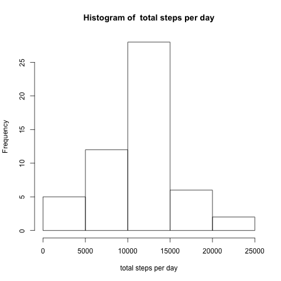
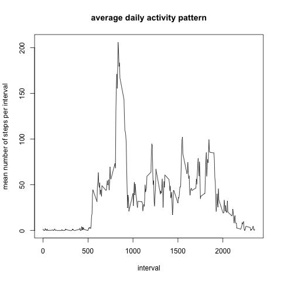

# Reproducible Research: Peer Assessment 1


## Loading and preprocessing the data

```r
df <- read.csv("activity.csv")
df$steps <- as.numeric(df$steps)
df_complete <- na.omit(df)
```

## What is mean total number of steps taken per day?

```r
df_sum <- aggregate(df_complete$steps, by = list(date = df_complete$date), FUN = sum)
png(filename = "figures/plot1.png", width = 480, height = 480)
hist(df_sum$x, xlab = "total steps per day", main = paste("Histogram of ", "total steps per day"))
dev.off()
```

```
## pdf 
##   2
```

```r
mean_sum <- mean(df_sum$x)
median_sum <- median(df_sum$x)
```



 mean of number of steps taken per day : 10766

 median of number of steps taken per day : 10765


## What is the average daily activity pattern?

```r
df_mean_interval <- aggregate(df_complete$steps, by = list(interval = df_complete$interval), 
    FUN = mean)
png(filename = "figures/plot2.png", width = 480, height = 480)
plot(df_mean_interval$interval, df_mean_interval$x, type = "l", xlab = "interval", 
    ylab = "mean number of steps per interval", main = "average daily activity pattern")
dev.off()
```

```
## pdf 
##   2
```

```r
df_mean_interval_sorted <- df_mean_interval[with(df_mean_interval, order(-x)), 
    ]
maximum_interval <- df_mean_interval_sorted[1, 1]
```



 5-minute interval,  containing the maximum number of steps : 835

## Imputing missing values

```r
len_df <- length(df$date)
len_df_complete <- length(df_complete$date)
na_count <- len_df - len_df_complete
```


 Total number of missing values : 835


## Are there differences in activity patterns between weekdays and weekends?
